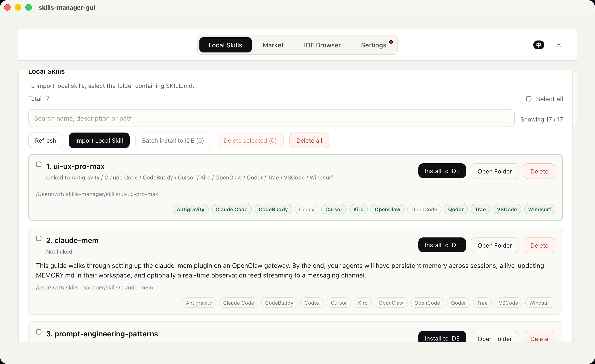
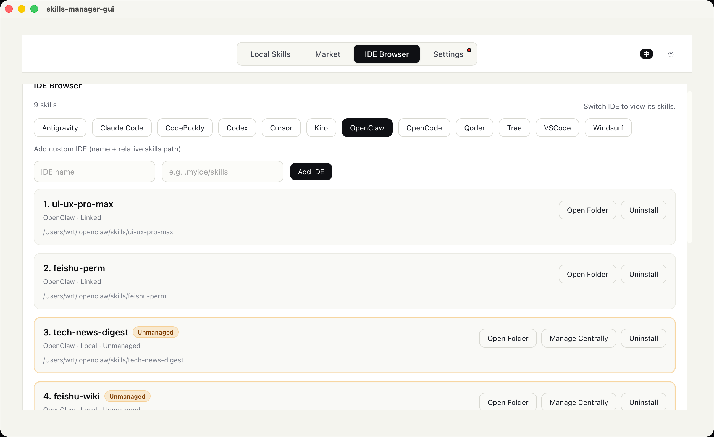

# Skills Manager

[English](README.md) | [中文](README_zh-CN.md)

**Multi-market aggregated search, one-click install to 10+ AI IDEs.** 
A professional cross-platform AI Skills Manager. It empowers you to search for skills across major marketplaces (such as Claude Plugins, SkillsLLM, SkillsMP, etc.), download them into a unified local repository, and securely install them into any supported AI development environment instantly via symlinks. Fully compatible with Windows, macOS, and Linux out-of-the-box, infinitely expanding your AI programming assistants' capabilities.





## ✨ Core Features

- 🔍 **Aggregated Market Search**: A one-stop search for high-quality skills based on public registries.
- 📦 **Unified Local Repository**: Centralized management of your downloaded skills (`~/.skills-manager/skills`).
- 🚀 **One-Click Distribution**: Install local skills to designated IDEs in seconds using secure system symlinks.
- 🛠️ **Multi-Dimensional Management**: Browse skills strictly per IDE, uninstall cleanly safely, and update local copies easily.
- ⚙️ **High Customizability**: Full support for adding niche or custom IDEs (with custom names and specific skills paths).
- 🔄 **Built-in Version Control**: If a newer version exists on the marketplace, sync your local copy seamlessly with one click.
- 🆕 **Silent Update Detection**: Automatically checks for the latest stable GitHub Release upon startup, elegantly notifying you via UI toasts.

## 🎯 Natively Supported IDEs (Alphabetical Order)

- **Antigravity**: `.gemini/antigravity/skills`
- **Claude Code**: `.claude/skills`
- **CodeBuddy**: `.codebuddy/skills`
- **Codex**: `.codex/skills`
- **Cursor**: `.cursor/skills`
- **Kiro**: `.kiro/skills`
- **OpenClaw**: `.openclaw/skills`
- **OpenCode**: `.config/opencode/skills`
- **Qoder**: `.qoder/skills`
- **Trae**: `.trae/skills`
- **VSCode**: `.github/skills`
- **Windsurf**: `.windsurf/skills`

## 📖 Usage Guide

### 📥 Installation & Setup

- **General Users (Recommended)**: Simply head to the [Releases page](https://github.com/Rito-w/skills-manager/releases) to download the latest executable installer.
- **Developers**: Clone the source code repository to run locally or customize in-depth.

### 🍎 macOS Security Note

Upon opening for the first time, macOS may present a "App is damaged and can't be opened" or "from an unidentified developer" security warning. This is due to the lack of an Apple developer commercial signature at this time. You can run the following terminal command to safely bypass it:

```bash
xattr -dr com.apple.quarantine "/Applications/skills-manager-gui.app"
```

### 🔍 1) Market 

- Aggregated display of available quality skills from various configured data sources.
- Clicking download automatically adds it to your local registry. If an older version exists, an "Update" button will be highlighted instead.

### 🗂️ 2) Local Skills

- A birds-eye view of all the skills currently downloaded on your device's unified repository.
- Click "Install" to select single or multiple target IDEs for bulk deployment and symlink distribution.

### ⌨️ 3) IDE Browser

- View the mounted skills lists independently, tailored to specific work environments (e.g., VSCode or Cursor).
- Safe Uninstallation: Removes the symlink if linked, or deletes the physical directory entirely if it's an isolated copy.
- Can't find your IDE? Easily click "Add Custom IDE" on the top right to register its skills directory.

## 👨‍💻 Installation & Development

### Prerequisites

- Node.js (LTS recommended)
- Rust (installed via rustup)
- macOS: Xcode Command Line Tools

### Local Development

```bash
pnpm install
pnpm tauri dev
```

### Build & Release

```bash
pnpm tauri build
```

## 📡 Remote Data Sources

- **Claude Plugins**: `https://claude-plugins.dev/api/skills`
- **SkillsLLM**: `https://skillsllm.com/api/skills`
- **SkillsMP**: `https://skillsmp.com/api/v1/skills/search` (API key configuration may be required)
- Source Code Download Proxy: `https://github-zip-api.val.run/zip?source=<repo>`

## 🛠 Tech Stack

- Desktop Runtime Framework: **Tauri 2**
- Frontend Interface Layer: **Vue 3** + **TypeScript** + **Vite**
- System Operations Layer: **Rust** (Command side)

## 📄 License

TBD
